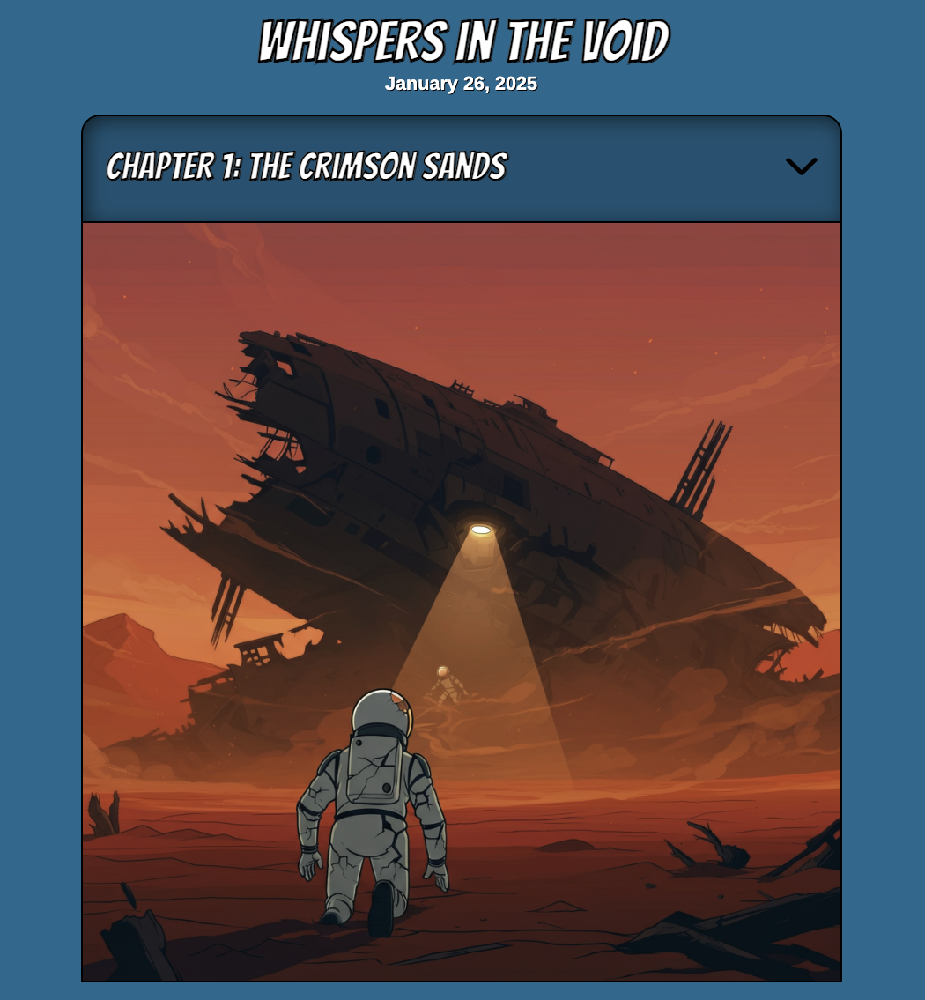

# 🧠 Short GenAI Stories 📕

Every day, at midnight (UTC), a new short story is generated!
You can read the stories online: 

https://short-ai-story.web.app/

This project is developed in Java, and uses the [LangChain4j](https://docs.langchain4j.dev/) open source LLM orchestration framework.

Stories are generated thanks to [Gemini](https://cloud.google.com/vertex-ai/generative-ai/docs/overview), 
and [Imagen 3](https://cloud.google.com/vertex-ai/generative-ai/docs/image/overview).



## The agent workflow


The [ExplicitStoryGeneratorAgent](fictionStoryAgent/src/main/java/storygen/ExplicitStoryGeneratorAgent.java) class 
is an _explicit workflow agent_, in the sense that the code is driving the planning and execution of the story generation.

The agent:
- calls Gemini to create a story, with a title, with 5 chapters with a title and content for each
- for each of the chapters' content, asks Gemini to create a specific image generation prompt
- invokes Imagen with the prompt to generate a few images (4 by default) for each chapter's content
- a self-reflection step requests Gemini to judge the resulting images of each chapter to know which image matches the story line best. 

## Setup and Usage

1. **Prerequisites:**
    - Java 21
    - Maven
    - Google Cloud Project with [Vertex AI enabled](https://cloud.google.com/vertex-ai/docs/start/cloud-environment)
    - [Cloud Run jobs](https://cloud.google.com/run/docs/create-jobs) runs the story generator agent
    - [Cloud Scheduler](https://cloud.google.com/scheduler/docs/schedule-run-cron-job-gcloud) schedules the generation of stories every day at midnight UTC
    - [Firestore](https://cloud.google.com/firestore), the document database to store the stories in 
    - [Firebase](https://firebase.google.com/) for serving the static assets and for accessing the Firestore database 
    - Set the following environment variables:
      - `GCP_PROJECT_ID`: your Google Cloud project ID
      - `GCP_LOCATION`: the location of the region you want to run your model in (eg. `europe-west1`, `us-central1`...)
      - `GCP_VERTEXAI_ENDPOINT`: the endpoint for the embedding model (eg. `europe-west1-aiplatform.googleapis.com:443`)
    - [Just](https://just.systems/) — a handy tool to run the most frequent commands to work on this project (building, serving, deploying...)
      - The [`justfile`](justfile) uses the (non-committed) `.env` file to access and reuse the environment variables above

2. **Serve and deploy static assets:**

To serve the static assets locally, and browse the website locally, run:

```bash
just serve
```

To deploy the static assets on Firebase:

```bash
just deploy
```

3. **Build the story generator agent:**

The story generator agent is written in Java with LangChain4j.
You can build the project with Maven, and package the application as a JAR with dependencies:

```bash
just package
```

4. **Building the container, creating a Cloud Run job, and scheduling it**

Build via Cloud Build:

```bash
just build
```

Create a Cloud Run job (create it **only once**):

```bash
just create-job
````

Schedule the job (create it **only once**):

```bash
just create-scheduler
```

## Contributing

See [`CONTRIBUTING.md`](CONTRIBUTING.md) for details.

No promise is made on accepting contributions, as I don't intend to maintain this project in the long run.

## License

Apache 2.0; see [`LICENSE`](LICENSE) for details.

## Disclaimer

This project is **not an official Google project**. It is not supported by
Google and Google specifically disclaims all warranties as to its quality,
merchantability, or fitness for a particular purpose.